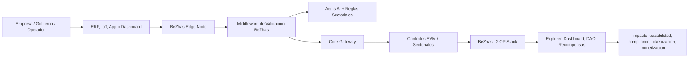

# Presentacion Actualizada del Workflow BeZhas Blockchain

**Version:** 2026-05-07  
**Ubicacion:** `D:\BeZhas-Blockchain\docs`  
**Tipo:** Presentacion ejecutiva y tecnica para inversionistas, partners, clientes enterprise y equipo interno.

---

## 1. Portada y Vision General

### BeZhas Blockchain

BeZhas Blockchain es una plataforma Web3 empresarial multi-sectorial que conecta procesos reales de empresas, gobiernos y operadores industriales con una blockchain L2 soberana basada en OP Stack, contratos EVM, agentes de IA, nodos Edge y herramientas MCP.

La propuesta central es simple: convertir eventos de negocio Web2, como manifiestos logisticos, sensores IoT, facturas, documentos legales, activos energeticos, datos de salud o ordenes de compra, en evidencia verificable, automatizable y monetizable dentro de la red BeZhas.

### Vision

Crear una infraestructura blockchain B2B donde las empresas puedan:

- Automatizar procesos con contratos inteligentes sin friccion cripto.
- Validar datos de negocio mediante IA, oraculos, nodos Edge y reglas sectoriales.
- Tokenizar activos, documentos, flujos de pago, certificados, permisos y derechos.
- Operar con experiencia Web2.5: dashboards SaaS, pagos fiat, API keys, webhooks y gas invisible.
- Monetizar su contribucion operacional con recompensas DePIN y staking corporativo.

### Tesis de Producto

BeZhas no vende una blockchain aislada. Vende un middleware operativo que traduce procesos empresariales en operaciones verificables on-chain y devuelve trazabilidad, cumplimiento, automatizacion, liquidez y nuevas vias de ingreso.

---

## 2. Sectores, Apps Desarrolladas, Problema y Soluciones

### Sectores que Maneja BeZhas

El ecosistema documentado cubre 16 verticales:

| Sector | Problema principal | Solucion BeZhas |
|---|---|---|
| Logistica | Falta de trazabilidad verificable, disputas de carga, baja integracion aduanera | NFTs logisticos, checkpoints, despacho aduanal, QualityEscrow, sensores IoT |
| Supply Chain | Ordenes de compra y proveedores sin auditoria compartida | SupplyTracker, ProcurementOrder, WarehouseInventory, SupplierScoreOracle |
| Salud | Datos medicos fragmentados y trazabilidad farmaceutica debil | HealthRecordSBT, PharmaTracker, HealthInsuranceEscrow |
| Energia | Dificultad para monetizar energia distribuida y ESG verificable | CarbonCreditToken, P2PEnergyMarket, ESGScoreOracle |
| Automotriz | Historial vehicular, autopartes y leasing poco confiables | VehicleIdentityNFT, AutoPartsRegistry, FleetLeaseEscrow |
| Manufactura | Certificados de calidad no verificables y mantenimiento reactivo | QualityCertificateNFT, DigitalTwinRegistry, PredictiveMaintenanceLog |
| Agricultura | Baja trazabilidad farm-to-table y financiamiento limitado | CropTokenFutures, AgriSupplyChain, AquaFarmMonitor, LandTitleNFT |
| Seguros | Ajuste manual de siniestros y pagos lentos | PolicyNFT, ClaimAdjuster, ReinsurancePool, ParametricInsurance |
| Educacion | Credenciales no portables y becas con baja transparencia | CourseTokenNFT, ScholarshipPool, EduDAO, SkillBadgeSBT |
| Entretenimiento | Fraude en tickets y regalías opacas | EventTicketNFT, RoyaltyDistributor, FanTokenDAO, StreamingRightsMarket |
| Legal | Evidencia digital y contratos sin ejecucion verificable | SmartLegalContract, EvidenceVault, ArbitrationDAO, IPRegistryNFT |
| Gobierno | Identidad, catastro, presupuesto y votacion con baja trazabilidad | CitizenIdentitySBT/NFT, PublicBudgetDAO, LandCadastralRegistry, VotingSystem |
| Finanzas | Credito, factoring y tesoreria sin rails programables | MicroLendingPool, InvoiceFactoring, TreasuryVault, CreditScoreOracle |
| Servicios | Marketplaces, suscripciones y reputacion sin escrow interoperable | FreelanceMarketplace, SubscriptionManager, SLAMonitor, ServiceReputation |
| Bienes raices | Titulos, rentas e hipotecas con baja liquidez y papeleo | LandTitleNFT, MortgageEscrow, tokenizacion de propiedad |
| Otros | Casos horizontales de fidelizacion, crowdfunding, P2P y caridad | LoyaltyProgram, CrowdfundingPool, P2PMarketplace, CharityVault |

### El Problema: El Gap en los Sectores

Los sectores anteriores comparten un mismo hueco estructural:

- Los sistemas Web2 registran eventos, pero no generan prueba inmutable ni auditoria compartida.
- Las blockchains publicas dan verificabilidad, pero suelen ser dificiles, caras o incomodas para empresas tradicionales.
- Los datos criticos siguen encerrados en ERP, hojas de calculo, emails, sensores y plataformas aisladas.
- Los procesos de compliance, seguros, pagos, certificacion y conciliacion se ejecutan tarde, con friccion humana y baja interoperabilidad.
- Las empresas no tienen incentivos economicos directos por aportar datos de calidad a una red de validacion.

### Apps Desarrolladas Dentro del Ecosistema

| App / Modulo | Rol dentro del workflow |
|---|---|
| **BeZhas Control Center** | Dashboard empresarial para telemetria L2, wallets criticas, gas, IA, Docker control, logs y estado de red |
| **BeZhas Edge Node** | Software B2B que recibe webhooks de ERP/IoT, hashea datos, valida con IA y firma transacciones en la L2 |
| **Core Gateway** | Punto unico de integracion para SSO, wallet, pagos, staking, farming, DAO, contratos, DEX, bridge y tesoreria |
| **BeZhas Wallet / Enterprise Wallet** | Wallet institucional con experiencia Web2.5, smart wallet, seguridad, paymaster y operaciones firmables |
| **BeZhas Pay / Pay Manager** | Capa de pagos, recargas, settlement, pasarela fiat/BEZ y experiencia comercial |
| **Corporate Gas Tank** | Sistema de saldo corporativo, recarga fiat y consumo predecible de gas en BEZ |
| **Aegis AI** | Motor de compliance, scoring, deteccion de anomalías y validacion previa al registro on-chain |
| **AI Engine / MCP Gateway** | Orquestacion de herramientas IA y MCP para automatizar validaciones sectoriales |
| **Smart Contracts Core** | BEZCoinV2, ValidatorRegistry, EdgeNodeRewards, SequencerRotation, SlashingManager, GovernanceSystem, StakingPool |
| **Smart Contracts Sectoriales** | Contratos por vertical para tokenizacion, trazabilidad, escrow, reputacion, identidad, energia, salud, gobierno y finanzas |
| **BeZhas-Docs / Developer Portal** | Portal de documentacion, SDKs, referencias API, contratos y presentaciones del ecosistema |
| **Apps secundarias** | BZ CargoLink, BZ PureScan, BZ Sphere, BZ Capital, BZ Genesis, BZ Prestige, bez-energy, bez-vision-scan, bez-wallet y herramientas de gestion |

### Flujo General del Workflow

---

## 3. La Solucion: Middleware de Validacion BeZhas

El Middleware de Validacion BeZhas es la capa que convierte datos empresariales en evidencia blockchain util.

### Componentes

| Componente | Funcion |
|---|---|
| Edge Node | Recibe eventos de ERP, sensores y apps empresariales |
| Hashing / privacidad | Convierte datos sensibles en huellas verificables sin publicar informacion privada |
| Aegis AI | Evalua compliance, anomalías, calidad, riesgo y reglas sectoriales |
| Core Gateway | Normaliza acceso a contratos, wallets, pagos, DAO, staking, bridge y DEX |
| Smart Contracts | Ejecutan reglas de negocio, escrow, tokenizacion, recompensas y gobernanza |
| Validator Registry | Registra empresas validadoras y su tier corporativo |
| EdgeNodeRewards | Recompensa contribuciones operativas y datos validados |
| SlashingManager | Penaliza downtime, datos fraudulentos, fallos de sequencer o inactividad DAO |

### Flujo de Validacion

1. El ERP, app o sensor envia un webhook al Edge Node.
2. El Edge Node autentica la llamada y calcula un hash del payload.
3. Aegis AI valida reglas: temperatura, trazabilidad, compliance, riesgo, calidad o fraude.
4. Si el evento es valido, el nodo firma una transaccion con wallet delegada o smart wallet.
5. La transaccion se registra en la L2 BeZhas con contratos sectoriales.
6. El sistema registra puntos de contribucion para la empresa.
7. La empresa puede reclamar recompensas, consultar dashboards y usar la evidencia para auditoria, seguros, pagos o gobernanza.

### Ventaja del Middleware

BeZhas evita que el cliente tenga que entender claves, gas, RPCs o contratos. La empresa opera con API keys, dashboards y pagos fiat, mientras la plataforma ejecuta criptografia real por debajo.

---

## 4. Stack Tecnologico

### Blockchain y Contratos

- L2 basada en OP Stack.
- Ejecucion EVM con `op-geth`.
- Consenso y secuenciacion con `op-node`.
- Publicacion de batches mediante `op-batcher`.
- Chain ID documentado: `2708`.
- Token de gas: `BEZCoinV2`.
- Contratos Solidity desarrollados y probados con Foundry.
- OpenZeppelin para ERC20, ERC721, ERC1155, AccessControl, ERC20Votes y patrones de seguridad.

### Backend y Middleware

- Node.js / Express para Edge Node, API y controladores.
- Core Gateway en `http://localhost:3001/api/gateway/v1` para desarrollo.
- Webhooks para SAP, Oracle NetSuite, Shopify y ERPs custom.
- Redis y PostgreSQL como soporte operativo.
- Docker Compose para levantar servicios de infraestructura.

### IA, Agentes y MCP

- Aegis AI para compliance, anomalías y validacion operacional.
- MCP Server para herramientas de agentes.
- AI Engine y OpenClaw Orchestrator para workflows automatizados.
- Integraciones multicanal con Telegram, WhatsApp, Discord y otros canales previstos.

### Frontend y Experiencia Enterprise

- Next.js / React para Control Center.
- TailwindCSS y componentes con iconografia Lucide.
- Dashboard B2B con vision Web2.5: fiat, API keys, onboarding guiado y abstraccion blockchain.
- Apps secundarias sectoriales y modulos de documentacion.

### Infraestructura y Observabilidad

- Docker, Nginx, monitoreo, logs y health checks.
- Control de servicios L2 desde dashboard privado.
- Blockscout previsto como explorer.
- Nodos Edge corporativos con health endpoints y heartbeats.

---

## 5. Modelo de Negocio y Monetizacion

### Fuentes de Ingreso

| Fuente | Descripcion |
|---|---|
| Gas en BEZ | Cada operacion on-chain consume BEZ como gas de red |
| Corporate Gas Tank | Empresas recargan saldo fiat; BeZhas convierte/gestiona BEZ para operar |
| SaaS B2B | Planes mensuales por dashboard, integraciones, soporte, SLA y modulos sectoriales |
| Fees transaccionales | Comisiones sobre pagos, bridge, marketplace, factoring, microlending y servicios DeFi |
| Servicios premium IA | Cobro por llamadas de validacion avanzada, scoring, compliance y oraculos |
| Staking corporativo | Empresas bloquean BEZ para validar, mejorar tier y acceder a recompensas |
| Sequencer fees | Validadores Gold/Platinum pueden participar en produccion de bloques |
| Integraciones enterprise | Setup, soporte, adaptadores ERP, auditoria, consultoria y despliegues privados |

### Parametros Economicos Documentados

- BEZ como token nativo de gas.
- Recompensas por contribucion operacional mediante puntos de validacion.
- Tiers corporativos:
  - Bronze: 10,000 BEZ.
  - Silver: 50,000 BEZ.
  - Gold: 250,000 BEZ.
  - Platinum: 1,000,000 BEZ.
- Fee de BeZhasPayment documentado tras reforma: 2.5%.
- Bridge fee documentado tras reforma: 0.5% con minimo de 10 BEZ.
- FreelanceMarketplace: 7.5%.
- MicroLendingPool: 1%.
- InvoiceFactoring: 1%.
- Caps de emision documentados:
  - StakingPool: 50,000 BEZ diarios.
  - LiquidityFarming: 25,000 BEZ diarios.

### Logica Comercial

La empresa paga por utilidad operativa, no por especulacion:

- Registra eventos por centavos.
- Obtiene trazabilidad y auditoria.
- Automatiza pagos, seguros, certificaciones o compliance.
- Recibe cashback/recompensas por operar datos de calidad.
- Puede subir de tier para validar mas y obtener mayor participacion en red.

---

## 6. Proyecciones Financieras: Vista a 5 Anos

> Nota: esta proyeccion es un modelo de negocio orientativo construido a partir de los parametros documentados del ecosistema. Debe validarse con datos reales de adopcion, pricing final, coste de infraestructura, auditorias, volumen de clientes y regulacion.

### Supuestos Base

- Precio de referencia usado en informes internos: `1 BEZ = 0.10 USD`.
- Clientes enterprise activos crecen por despliegue sectorial.
- Ingreso promedio mensual por cliente combina SaaS, soporte, gas, IA y uso de contratos.
- Margen bruto mejora con automatizacion, reutilizacion de contratos sectoriales y economias de escala.
- No se contabiliza como ingreso directo el ahorro de emisiones; se considera proteccion tokenomica y reduccion de dilucion.

### Escenario Base

| Ano | Clientes enterprise activos | ARPA mensual estimado | Ingreso anual estimado | Margen bruto estimado | EBITDA estimado |
|---:|---:|---:|---:|---:|---:|
| 1 | 25 | 1,500 USD | 450,000 USD | 55% | -250,000 USD |
| 2 | 100 | 2,000 USD | 2,400,000 USD | 62% | 300,000 USD |
| 3 | 350 | 2,500 USD | 10,500,000 USD | 68% | 2,100,000 USD |
| 4 | 900 | 3,000 USD | 32,400,000 USD | 72% | 8,750,000 USD |
| 5 | 2,000 | 3,500 USD | 84,000,000 USD | 75% | 25,200,000 USD |

### Drivers de Crecimiento

- Expansion desde logistica/supply chain hacia energia, salud, finanzas, gobierno y seguros.
- Plantillas de integracion ERP reutilizables: SAP, Oracle NetSuite, Shopify y HTTP generico.
- Apps secundarias por vertical conectadas al Core Gateway.
- Recompensas DePIN que incentivan nodos empresariales siempre activos.
- Mayor utilidad de BEZ por gas, staking, DAO, bridge, pagos y fees de servicios.

### Riesgos Financieros

- Costo de liquidacion L1 si la L2 publica batches con poca eficiencia.
- Coste de proveedores IA si las consultas premium no tienen pricing suficiente.
- Riesgo de emision excesiva si no se mantienen caps y controles.
- Necesidad de auditorias de seguridad antes de mainnet.
- Dependencia de adopcion B2B real y ciclos de venta enterprise.

---

## 7. Impacto en los Sectores

### Impacto Operativo

- Menos disputas por evidencia compartida y verificable.
- Automatizacion de validaciones y escrows.
- Reduccion de tiempos de conciliacion entre empresas.
- Datos IoT y ERP convertidos en eventos accionables.
- Mayor visibilidad para directores de operacion, compliance, finanzas y tecnologia.

### Impacto Economico

- Nuevos ingresos por uso de red, gas, comisiones, integraciones y servicios premium.
- Incentivos para empresas validadoras mediante DePIN mining.
- Menor presion inflacionaria por caps y reformas tokenomicas.
- Posibilidad de liquidez sobre activos tradicionalmente iliquidos: facturas, propiedades, energia, creditos, certificados, tickets, derechos y mercancias.

### Impacto por Vertical

| Vertical | Impacto esperado |
|---|---|
| Logistica | Auditoria de contenedores, sensores, calidad y aduanas con prueba inmutable |
| Supply Chain | Trazabilidad de origen, proveedores y ordenes de compra |
| Salud | Interoperabilidad de registros, trazabilidad farmaceutica y seguros mas automaticos |
| Energia | Mercados P2P, creditos de carbono y ESG verificable |
| Finanzas | Factoring, microcredito y scoring programable |
| Gobierno | Identidad, catastro, presupuestos y votacion con mayor transparencia |
| Legal | Evidencia digital, contratos ejecutables y arbitraje trazable |
| Manufactura | Certificados de calidad y gemelos digitales con telemetria |
| Seguros | Pagos parametricos y reaseguro programable |
| Educacion | Credenciales portables y becas auditables |

---

## Cierre Ejecutivo

BeZhas Blockchain se posiciona como una capa de validacion empresarial para procesos reales. Su fuerza no esta solo en la L2, sino en el conjunto: Edge Node, Core Gateway, Aegis AI, contratos sectoriales, Corporate Gas Tank, dashboard B2B y tokenomics vinculada al uso.

La oportunidad es capturar el espacio entre Web2 corporativo y Web3 verificable: hacer que blockchain sea invisible para el usuario empresarial, pero indispensable para la operacion.

