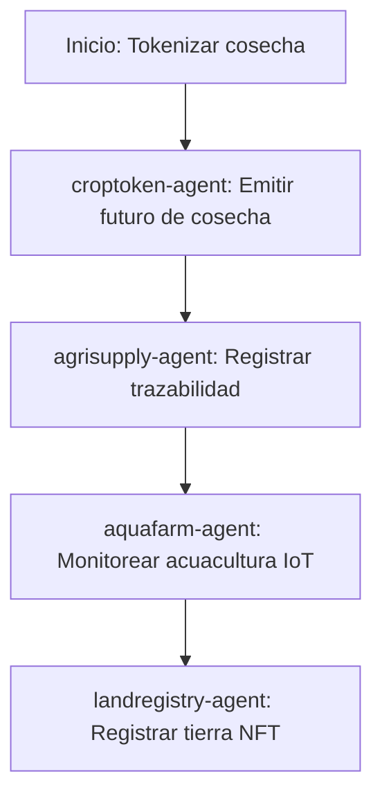

# Sector Agricultura

## Descripción
Tokenización de cosechas, trazabilidad farm-to-table y monitoreo IoT de acuacultura.

## Agentes principales
- `croptoken-agent`: Futuros de cosecha tokenizados
- `agrisupply-agent`: Trazabilidad agrícola
- `aquafarm-agent`: Monitoreo de acuacultura
- `landregistry-agent`: Registro de tierras NFT

## Contratos relevantes
- `CropTokenFutures.sol`: Futuros de cosecha
- `AgriSupplyChain.sol`: Trazabilidad agrícola
- `AquaFarmMonitor.sol`: Monitoreo IoT
- `LandTitleNFT.sol`: Registro de tierras

## Ejemplo de flujo
1. Tokenizar cosecha como futuro
2. Registrar trazabilidad y certificaciones
3. Monitorear acuacultura vía IoT

## Diagrama de flujo


## Ejemplo avanzado de integración
```js
// 1. Tokenizar cosecha como futuro
const cropFuture = await client.agriculture.tokenizeCrop({
	farmer: '0xAgricultor',
	cropType: 'Maíz',
	quantity: 100,
	deliveryDate: '2026-09-01'
});

// 2. Registrar trazabilidad y certificaciones
await client.agriculture.registerTrace({
	cropId: cropFuture.id,
	gps: '19.4326,-99.1332',
	certifications: ['Orgánico', 'FairTrade']
});

// 3. Monitorear acuacultura vía IoT
await client.agriculture.monitorAquaFarm({
	farmId: 'AQUA-001',
	sensors: { temp: 22.5, ph: 7.2 }
});
```

## Endpoints API
- `GET /v1/agriculture/crops`
- `POST /v1/agriculture/trace`

## Ejemplo de código
```js
const crop = await client.agriculture.tokenizeCrop({ ... });
```
