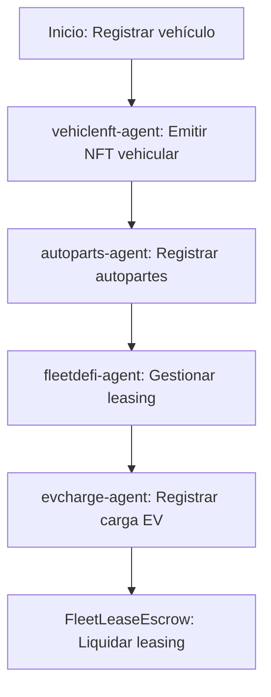

# Sector Automotriz

## Descripción
Identidad vehicular, registro de autopartes y leasing descentralizado usando NFTs y contratos de escrow.

## Agentes principales
- `vehiclenft-agent`: Identidad vehicular NFT
- `autoparts-agent`: Registro de autopartes
- `fleetdefi-agent`: Leasing de flotas
- `evcharge-agent`: Estaciones de carga EV

## Contratos relevantes
- `VehicleIdentityNFT.sol`: NFT de identidad vehicular
- `AutoPartsRegistry.sol`: Registro de autopartes
- `FleetLeaseEscrow.sol`: Escrow de leasing

## Ejemplo de flujo
1. Registrar vehículo como NFT
2. Registrar autopartes y lotes
3. Gestionar leasing y mantenimiento

## Diagrama de flujo


## Ejemplo avanzado de integración
```js
// 1. Registrar vehículo como NFT
const vehicleNFT = await client.automotive.registerVehicle({
	vin: '1HGCM82633A004352',
	owner: '0xPropietario',
	make: 'Toyota',
	model: 'Corolla',
	year: 2025
});

// 2. Registrar autopartes
await client.automotive.registerPart({
	vehicleId: vehicleNFT.id,
	partNumber: 'A1234',
	manufacturer: 'Bosch',
	batch: 'Lote2026'
});

// 3. Gestionar leasing y mantenimiento
await client.automotive.createLease({
	vehicleId: vehicleNFT.id,
	lessee: '0xArrendatario',
	durationMonths: 36,
	monthlyPayment: 300
});
await client.automotive.logMaintenance({
	vehicleId: vehicleNFT.id,
	service: 'Cambio de aceite',
	date: '2026-03-27'
});
```

## Endpoints API
- `GET /v1/automotive/vehicles`
- `POST /v1/automotive/lease`

## Ejemplo de código
```js
const vehicle = await client.automotive.registerVehicle({ ... });
```
