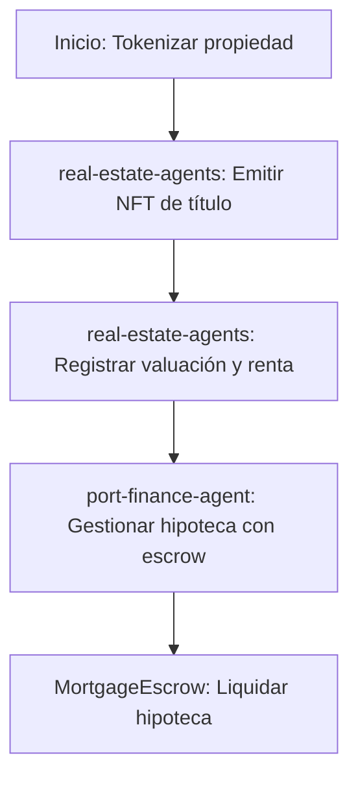

# Sector Bienes Raíces

## Descripción
Tokenización de propiedades, gestión de rentas y financiamiento inmobiliario usando agentes y contratos especializados.

## Agentes principales
- `real-estate-agents`: Tokenización, valuación, renta e hipoteca
- `cold-chain-agent`: Cadena de frío para logística inmobiliaria
- `port-finance-agent`: Financiamiento portuario

## Contratos relevantes
- `LandTitleNFT.sol`: NFT de títulos de propiedad
- `MortgageEscrow.sol`: Escrow de hipotecas

## Ejemplo de flujo
1. Tokenizar propiedad como NFT
2. Registrar valuación y renta
3. Gestionar hipoteca con escrow

## Diagrama de flujo


## Ejemplo avanzado de integración
```js
// 1. Tokenizar propiedad como NFT
const propertyNFT = await client.realestate.tokenize({
	address: 'Av. Reforma 123',
	owner: '0xPropietario',
	value: 500000,
});

// 2. Registrar valuación y renta
await client.realestate.registerValuation({
	propertyId: propertyNFT.id,
	value: 520000,
});
await client.realestate.registerRent({
	propertyId: propertyNFT.id,
	tenant: '0xInquilino',
	monthly: 1000,
});

// 3. Gestionar hipoteca con escrow
await client.realestate.requestMortgage({
	propertyId: propertyNFT.id,
	amount: 300000,
});
```

## Endpoints API
- `GET /v1/realestate/properties`
- `POST /v1/realestate/mortgage`

## Ejemplo de código
```js
const property = await client.realestate.tokenize({ ... });
```
