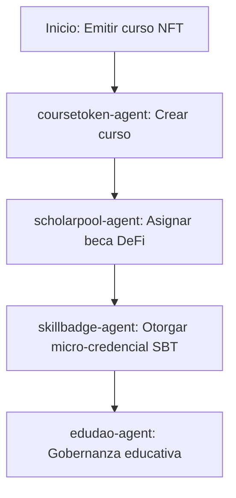

# Sector Educación

## Descripción
Cursos tokenizados, becas DeFi y micro-credenciales SBT para instituciones educativas.

## Agentes principales
- `coursetoken-agent`: Cursos tokenizados
- `scholarpool-agent`: Pools de becas
- `edudao-agent`: Gobernanza educativa
- `skillbadge-agent`: Micro-credenciales SBT

## Contratos relevantes
- `CourseTokenNFT.sol`: Cursos NFT
- `ScholarshipPool.sol`: Pools de becas
- `EduDAO.sol`: DAO educativa
- `SkillBadgeSBT.sol`: Micro-credenciales

## Ejemplo de flujo
1. Emitir curso como NFT
2. Asignar beca DeFi
3. Otorgar micro-credencial SBT

## Diagrama de flujo


## Ejemplo avanzado de integración
```js
// 1. Emitir curso como NFT
const courseNFT = await client.education.issueCourse({
	title: 'Blockchain 101',
	instructor: '0xProfesor',
	startDate: '2026-04-01',
	durationWeeks: 8
});

// 2. Asignar beca DeFi
await client.education.assignScholarship({
	courseId: courseNFT.id,
	student: '0xEstudiante',
	amount: 500
});

// 3. Otorgar micro-credencial SBT
await client.education.issueSkillBadge({
	student: '0xEstudiante',
	skill: 'Solidity',
	level: 'Avanzado'
});
```

## Endpoints API
- `GET /v1/education/courses`
- `POST /v1/education/scholarship`

## Ejemplo de código
```js
const course = await client.education.issueCourse({ ... });
```
