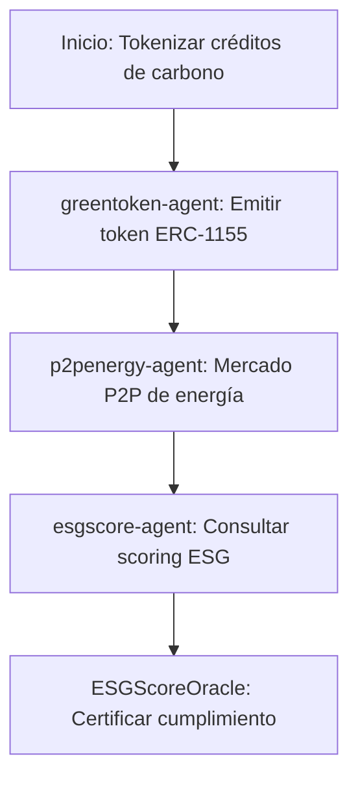

# Sector Energía Renovable

## Descripción
Tokenización de créditos de carbono, mercados P2P de energía y scoring ESG usando contratos ERC-1155 y oráculos.

## Agentes principales
- `greentoken-agent`: Créditos de carbono y RECs
- `p2penergy-agent`: Mercado P2P de energía
- `esgscore-agent`: Oráculo de scoring ESG

## Contratos relevantes
- `CarbonCreditToken.sol`: Créditos de carbono (ERC-1155)
- `P2PEnergyMarket.sol`: Mercado de energía
- `ESGScoreOracle.sol`: Oráculo ESG

## Ejemplo de flujo
1. Tokenizar créditos de carbono
2. Transar energía en mercado P2P
3. Consultar scoring ESG

## Diagrama de flujo


## Ejemplo avanzado de integración
```js
// 1. Tokenizar créditos de carbono
const carbonToken = await client.energy.tokenizeCarbon({
	company: '0xEmpresa',
	amount: 100,
	type: 'REC',
});

// 2. Transar energía en mercado P2P
await client.energy.trade({
	seller: '0xEmpresa',
	buyer: '0xBuyer',
	amount: 50,
});

// 3. Consultar scoring ESG
const esg = await client.energy.getESGScore('0xEmpresa');
console.log('ESG Score:', esg);
```

## Endpoints API
- `GET /v1/energy/credits`
- `POST /v1/energy/trade`
- `GET /v1/energy/esgscore`

## Ejemplo de código
```js
const credits = await client.energy.getCredits('0xEmpresa');
```
