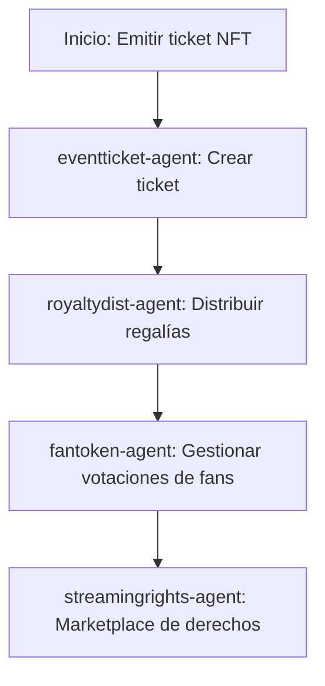

# Sector Entretenimiento

## Descripción
Tickets de eventos, distribución de regalías y DAOs de fans usando NFTs y contratos de streaming/licensing.

## Agentes principales
- `eventticket-agent`: Tickets de eventos NFT
- `royaltydist-agent`: Distribución de regalías
- `fantoken-agent`: DAO de fans
- `streamingrights-agent`: Marketplace de derechos de streaming

## Contratos relevantes
- `EventTicketNFT.sol`: Tickets NFT
- `RoyaltyDistributor.sol`: Regalías
- `FanTokenDAO.sol`: DAO de fans
- `StreamingRightsMarketplace.sol`: Marketplace de derechos

## Ejemplo de flujo
1. Emitir ticket NFT
2. Distribuir regalías automáticamente
3. Gestionar votaciones de fans

## Diagrama de flujo


## Ejemplo avanzado de integración
```js
// 1. Emitir ticket NFT
const ticketNFT = await client.entertainment.issueTicket({
	event: 'Concierto XYZ',
	holder: '0xFan',
	seat: 'A12',
});

// 2. Distribuir regalías automáticamente
await client.entertainment.distributeRoyalties({
	eventId: ticketNFT.eventId,
	amount: 10000,
	recipients: [
		{ address: '0xArtista', share: 70 },
		{ address: '0xProductor', share: 30 }
	]
});

// 3. Gestionar votaciones de fans
await client.entertainment.voteFanDAO({
	proposalId: 'PROP-001',
	voter: '0xFan',
	vote: 'yes'
});
```

## Endpoints API
- `GET /v1/entertainment/tickets`
- `POST /v1/entertainment/royalties`

## Ejemplo de código
```js
const ticket = await client.entertainment.issueTicket({ ... });
```
