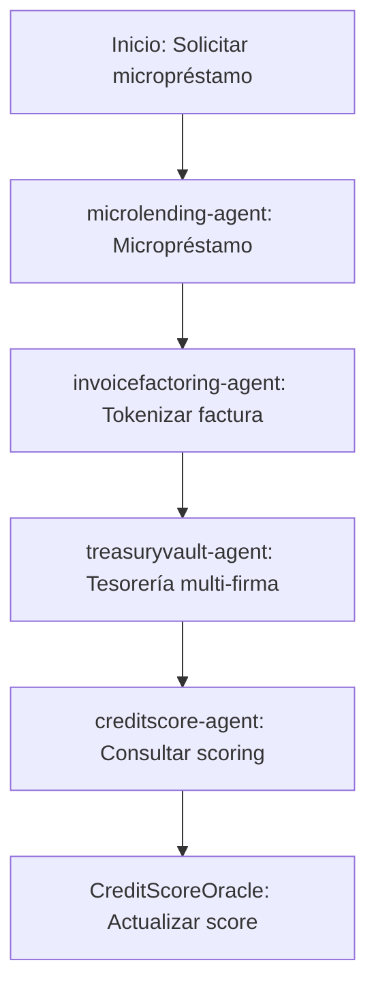

# Sector Finanzas

## Descripción
Micropréstamos, factoring de facturas y tesorería multi-firma usando contratos DeFi y oráculos de scoring crediticio.

## Agentes principales
- `microlending-agent`: Micropréstamos
- `invoicefactoring-agent`: Factoring de facturas
- `treasuryvault-agent`: Tesorería multi-firma
- `creditscore-agent`: Oráculo de scoring crediticio

## Contratos relevantes
- `MicroLendingPool.sol`: Micropréstamos
- `InvoiceFactoring.sol`: Factoring
- `TreasuryVault.sol`: Tesorería
- `CreditScoreOracle.sol`: Scoring crediticio

## Ejemplo de flujo
1. Solicitar micropréstamo
2. Tokenizar factura para factoring
3. Consultar scoring crediticio

## Diagrama de flujo


## Ejemplo avanzado de integración
```js
// 1. Solicitar micropréstamo
const loan = await client.finance.requestMicroloan({
	borrower: '0xSolicitante',
	amount: 2000,
	termMonths: 12
});

// 2. Tokenizar factura para factoring
const invoice = await client.finance.tokenizeInvoice({
	supplier: '0xProveedor',
	buyer: '0xComprador',
	amount: 5000,
	dueDate: '2026-06-01'
});

// 3. Consultar scoring crediticio
const score = await client.finance.getCreditScore('0xSolicitante');
console.log('Credit Score:', score);
```

## Endpoints API
- `POST /v1/finance/microlending`
- `GET /v1/finance/creditscore`

## Ejemplo de código
```js
const loan = await client.finance.requestMicroloan({ ... });
```
