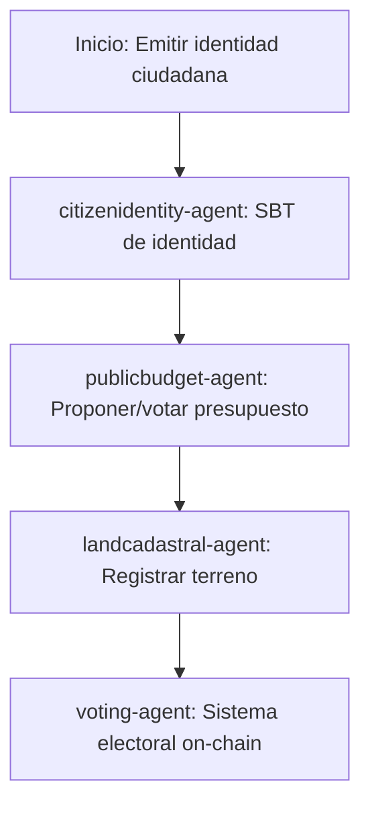

# Sector Gobierno

## Descripción
Identidad ciudadana, presupuesto público DAO y registro catastral usando SBTs y contratos de gobernanza.

## Agentes principales
- `citizenidentity-agent`: Identidad ciudadana SBT
- `publicbudget-agent`: DAO de presupuesto público
- `landcadastral-agent`: Registro catastral
- `voting-agent`: Sistema electoral on-chain

## Contratos relevantes
- `CitizenIdentitySBT.sol`: Identidad ciudadana
- `PublicBudgetDAO.sol`: Presupuesto público
- `LandCadastralNFT.sol`: Registro catastral
- `VotingSystem.sol`: Sistema electoral

## Ejemplo de flujo
1. Emitir identidad ciudadana SBT
2. Proponer y votar presupuesto público
3. Registrar terreno en catastro

## Diagrama de flujo


## Ejemplo avanzado de integración
```js
// 1. Emitir identidad ciudadana SBT
const identitySBT = await client.gov.issueIdentity({
	citizen: '0xCiudadano',
	name: 'Juan Pérez',
	birthdate: '1990-01-01'
});

// 2. Proponer y votar presupuesto público
const proposal = await client.gov.proposeBudget({
	title: 'Mejoras en infraestructura',
	amount: 1000000
});
await client.gov.voteBudget({
	proposalId: proposal.id,
	voter: '0xCiudadano',
	vote: 'yes'
});

// 3. Registrar terreno en catastro
await client.gov.registerLand({
	owner: '0xCiudadano',
	coordinates: '19.4326,-99.1332',
	area: 500
});
```

## Endpoints API
- `GET /v1/gov/identity`
- `POST /v1/gov/budget`

## Ejemplo de código
```js
const identity = await client.gov.issueIdentity({ ... });
```
