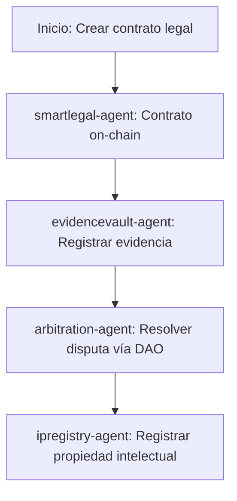

# Sector Legal

## Descripción
Contratos legales on-chain, bóveda de evidencia y arbitraje descentralizado usando DAOs y NFTs.

## Agentes principales
- `smartlegal-agent`: Contratos legales on-chain
- `evidencevault-agent`: Bóveda de evidencia
- `arbitration-agent`: DAO de arbitraje
- `ipregistry-agent`: Registro de propiedad intelectual

## Contratos relevantes
- `SmartLegalContract.sol`: Contratos legales
- `EvidenceVault.sol`: Bóveda de evidencia
- `ArbitrationDAO.sol`: DAO de arbitraje
- `IPRegistry.sol`: Registro de propiedad intelectual

## Ejemplo de flujo
1. Crear contrato legal on-chain
2. Registrar evidencia digital
3. Resolver disputa vía DAO

## Diagrama de flujo


## Ejemplo avanzado de integración
```js
// 1. Crear contrato legal on-chain
const legalContract = await client.legal.createContract({
	parties: ['0xParteA', '0xParteB'],
	terms: 'Acuerdo de confidencialidad',
	effectiveDate: '2026-04-01'
});

// 2. Registrar evidencia digital
await client.legal.registerEvidence({
	contractId: legalContract.id,
	fileHash: 'Qm123...',
	description: 'Documento firmado digitalmente'
});

// 3. Resolver disputa vía DAO
await client.legal.initiateArbitration({
	contractId: legalContract.id,
	issue: 'Incumplimiento de cláusula',
	evidence: ['Qm123...']
});
```

## Endpoints API
- `POST /v1/legal/contract`
- `POST /v1/legal/evidence`

## Ejemplo de código
```js
const contract = await client.legal.createContract({ ... });
```
