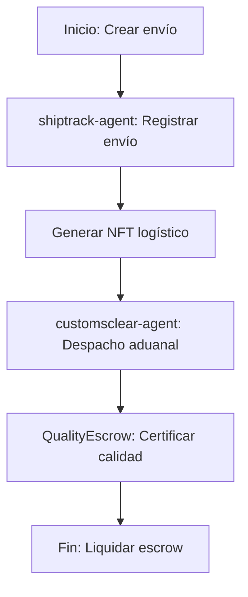

# Logística

## Descripción
Automatización y trazabilidad de envíos, aduanas y activos logísticos usando agentes inteligentes y contratos NFT.

## Agentes principales
- `shiptrack-agent`: Rastreo de envíos y checkpoints
- `customsclear-agent`: Despacho aduanal automatizado
- `rwa-cargo-agent`: Tokenización de carga RWA

## Contratos clave
- `BeZhasLogisticsNFT.sol`: NFT de activos logísticos
- `QualityEscrow.sol`: Escrow de calidad

## Ejemplo de flujo
1. Crear envío con `shiptrack-agent`
2. Generar NFT logístico
3. Solicitar despacho aduanal vía API
4. Certificar calidad con escrow

## Diagrama de flujo


## Ejemplo avanzado de integración
```js
// 1. Crear envío y registrar checkpoints
const shipment = await client.shipments.create({
	origin: 'CDMX',
	destination: 'Veracruz',
	cargo: 'Contenedor 123',
});
await client.shipments.addCheckpoint({
	shipmentId: shipment.id,
	location: 'Puebla',
	timestamp: Date.now(),
});

// 2. Tokenizar carga como NFT
const nft = await client.logistics.mintNFT({
	shipmentId: shipment.id,
	metadata: { peso: '10t', tipo: 'Electrónica' }
});

// 3. Solicitar despacho aduanal
await client.customs.clear({ shipmentId: shipment.id });

// 4. Certificar calidad y liquidar escrow
await client.escrow.release({ shipmentId: shipment.id });
```

## Endpoints relevantes
- `POST /v1/supply/shipments`
- `POST /v1/supply/customs/clear`
- `GET /v1/supply/checkpoints`

## Buenas prácticas
- Usar testnet para pruebas
- No exponer datos sensibles de carga o rutas
