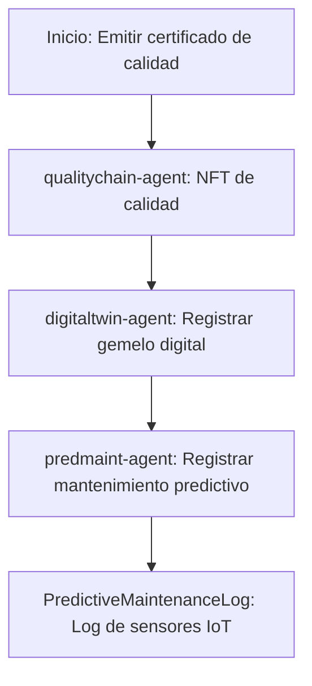

# Sector Manufactura

## Descripción
Certificados de calidad, gemelos digitales y mantenimiento predictivo usando NFTs y sensores IoT.

## Agentes principales
- `qualitychain-agent`: Certificados de calidad NFT
- `digitaltwin-agent`: Gemelos digitales
- `supplymrp-agent`: Planificación de materiales
- `predmaint-agent`: Mantenimiento predictivo

## Contratos relevantes
- `QualityCertificateNFT.sol`: Certificados de calidad
- `DigitalTwinRegistry.sol`: Gemelos digitales
- `PredictiveMaintenanceLog.sol`: Log de mantenimiento

## Ejemplo de flujo
1. Emitir certificado de calidad NFT
2. Registrar gemelo digital con telemetría
3. Registrar mantenimiento predictivo

## Diagrama de flujo


## Ejemplo avanzado de integración
```js
// 1. Emitir certificado de calidad NFT
const certNFT = await client.manufacturing.issueCertificate({
	batch: 'Lote2026',
	inspector: '0xInspector',
	result: 'Aprobado',
});

// 2. Registrar gemelo digital
await client.manufacturing.registerDigitalTwin({
	assetId: 'EQ-001',
	sensors: ['temp', 'vibration'],
	metadata: { fabricante: 'Siemens' }
});

// 3. Registrar mantenimiento predictivo
await client.manufacturing.logMaintenance({
	assetId: 'EQ-001',
	type: 'Predictivo',
	date: '2026-03-27',
	notes: 'Sin anomalías'
});
```

## Endpoints API
- `GET /v1/manufacturing/certificates`
- `POST /v1/manufacturing/maintenance`

## Ejemplo de código
```js
const cert = await client.manufacturing.issueCertificate({ ... });
```
