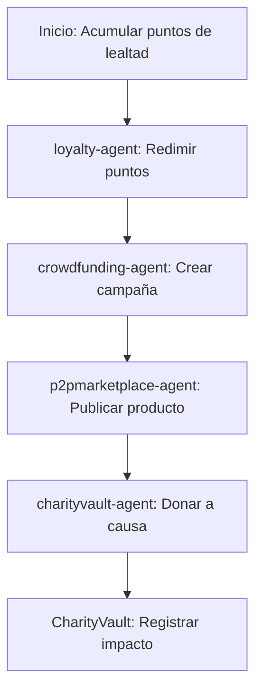

# Sector Otros

## Descripción
Programas de lealtad, crowdfunding, marketplaces P2P y bóvedas de caridad usando contratos y agentes especializados.

## Agentes principales
- `loyalty-agent`: Programa de lealtad
- `crowdfunding-agent`: Crowdfunding
- `p2pmarketplace-agent`: Marketplace P2P
- `charityvault-agent`: Bóveda de caridad

## Contratos relevantes
- `LoyaltyProgram.sol`: Programa de lealtad
- `CrowdfundingPool.sol`: Crowdfunding
- `P2PMarketplace.sol`: Marketplace
- `CharityVault.sol`: Bóveda de caridad

## Ejemplo de flujo
1. Acumular puntos de lealtad y redimir
2. Crear campaña de crowdfunding
3. Publicar producto en marketplace P2P
4. Donar a causa en bóveda de caridad

## Diagrama de flujo


## Ejemplo avanzado de integración
```js
// 1. Acumular puntos de lealtad y redimir
await client.other.addLoyaltyPoints({
	user: '0xUsuario',
	points: 100
});
await client.other.redeemLoyaltyPoints({
	user: '0xUsuario',
	reward: 'Descuento 10%'
});

// 2. Crear campaña de crowdfunding
const campaign = await client.other.createCrowdfunding({
	title: 'Proyecto Solar',
	goal: 20000,
	deadline: '2026-08-01'
});

// 3. Publicar producto en marketplace P2P
await client.other.publishProduct({
	seller: '0xVendedor',
	name: 'Laptop usada',
	price: 300
});

// 4. Donar a causa en bóveda de caridad
await client.other.donateCharity({
	donor: '0xUsuario',
	cause: 'Educación',
	amount: 50
});
```

## Endpoints API
- `POST /v1/other/loyalty`
- `POST /v1/other/crowdfunding`

## Ejemplo de código
```js
const points = await client.other.addLoyaltyPoints({ ... });
```
