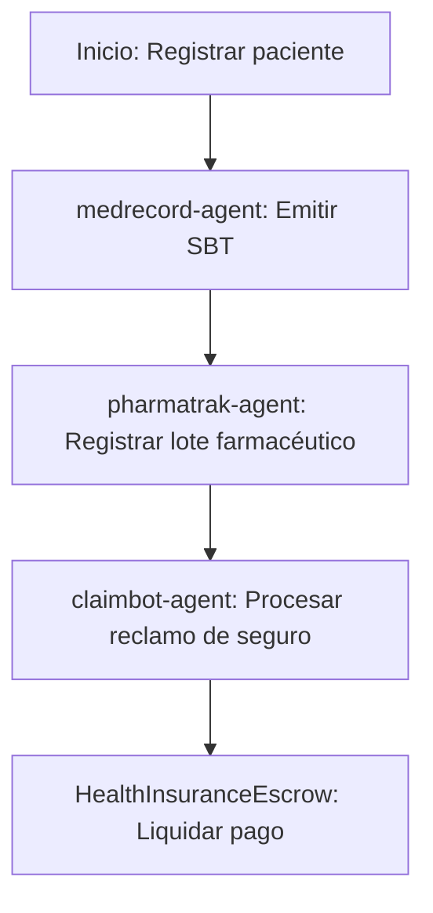

# Sector Salud

## Descripción
Gestión de registros médicos, trazabilidad farmacéutica y seguros de salud usando contratos SBT y agentes sectoriales.

## Agentes principales
- `medrecord-agent`: Registros médicos SBT
- `pharmatrak-agent`: Trazabilidad de fármacos
- `claimbot-agent`: Escrow de seguros médicos

## Contratos relevantes
- `HealthRecordSBT.sol`: Soulbound token de registros médicos
- `PharmaTracker.sol`: Trazabilidad de fármacos
- `HealthInsuranceEscrow.sol`: Escrow de seguros de salud

## Ejemplo de flujo
1. Registrar paciente y emitir SBT
2. Registrar lote farmacéutico
3. Procesar reclamo de seguro con escrow

## Diagrama de flujo


## Ejemplo avanzado de integración
```js
// 1. Registrar paciente y emitir SBT
const patient = await client.health.registerPatient({
	name: 'Ana',
	wallet: '0xPaciente',
});
const sbt = await client.health.issueSBT({
	patientId: patient.id,
	data: { bloodType: 'O+', allergies: ['Penicilina'] }
});

// 2. Registrar lote farmacéutico
await client.pharma.registerBatch({
	batchId: 'LOTEXYZ',
	drug: 'Paracetamol',
	expiration: '2027-01-01'
});

// 3. Procesar reclamo de seguro
await client.insurance.claim({
	patientId: patient.id,
	reason: 'Hospitalización',
	amount: 1000
});
```

## Endpoints API
- `GET /v1/health/records`
- `POST /v1/health/claims`

## Ejemplo de código
```js
const record = await client.health.getRecords('0xPaciente');
```
