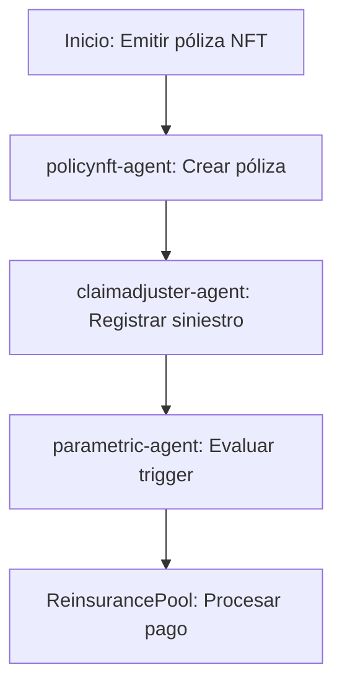

# Sector Seguros

## Descripción
Pólizas tokenizadas, ajuste de siniestros y reaseguro DeFi usando NFTs y contratos paramétricos.

## Agentes principales
- `policynft-agent`: Pólizas NFT
- `claimadjuster-agent`: Ajuste de siniestros
- `reinsurance-agent`: Pools de reaseguro
- `parametric-agent`: Seguros paramétricos

## Contratos relevantes
- `PolicyNFT.sol`: Pólizas tokenizadas
- `ClaimAdjuster.sol`: Ajuste de siniestros
- `ReinsurancePool.sol`: Pools de reaseguro
- `ParametricInsurance.sol`: Seguros paramétricos

## Ejemplo de flujo
1. Emitir póliza NFT
2. Registrar siniestro y ajuste
3. Procesar pago automático por trigger paramétrico

## Diagrama de flujo


## Ejemplo avanzado de integración
```js
// 1. Emitir póliza NFT
const policyNFT = await client.insurance.issuePolicy({
	insured: '0xAsegurado',
	coverage: 'Incendio',
	sum: 10000,
	duration: 365
});

// 2. Registrar siniestro y ajuste
await client.insurance.registerClaim({
	policyId: policyNFT.id,
	event: 'Incendio',
	loss: 8000
});

// 3. Procesar pago automático por trigger paramétrico
await client.insurance.processParametric({
	policyId: policyNFT.id,
	trigger: 'Temperatura > 60°C',
	payout: 8000
});
```

## Endpoints API
- `GET /v1/insurance/policies`
- `POST /v1/insurance/claim`

## Ejemplo de código
```js
const policy = await client.insurance.issuePolicy({ ... });
```
