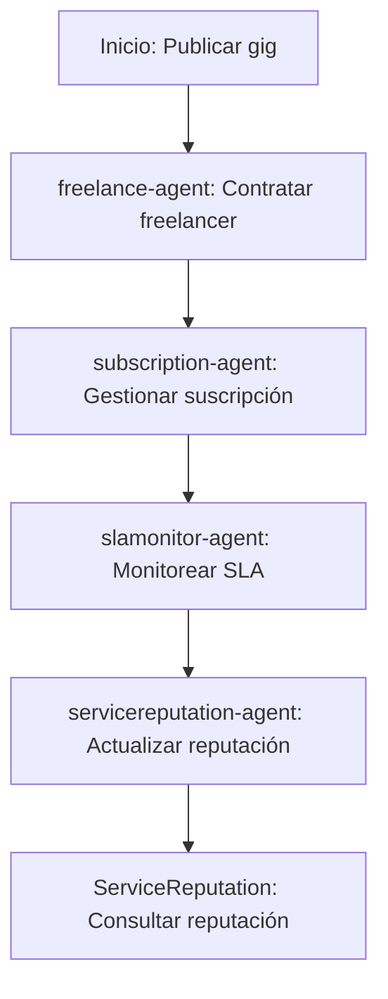

# Sector Servicios

## Descripción
Marketplace de freelancers, gestión de suscripciones y reputación de proveedores usando contratos y agentes sectoriales.

## Agentes principales
- `freelance-agent`: Marketplace de freelancers
- `subscription-agent`: Gestión de suscripciones
- `slamonitor-agent`: Monitor de SLAs
- `servicereputation-agent`: Reputación de proveedores

## Contratos relevantes
- `FreelanceMarketplace.sol`: Marketplace
- `SubscriptionManager.sol`: Suscripciones
- `SLAMonitor.sol`: Monitor de SLAs
- `ServiceReputation.sol`: Reputación de proveedores

## Ejemplo de flujo
1. Publicar gig y contratar freelancer
2. Gestionar suscripción y renovaciones
3. Monitorear SLAs y reputación

## Diagrama de flujo


## Ejemplo avanzado de integración
```js
// 1. Publicar gig y contratar freelancer
const gig = await client.services.publishGig({
	title: 'Desarrollo web',
	budget: 1500,
	deadline: '2026-05-01'
});
await client.services.hireFreelancer({
	gigId: gig.id,
	freelancer: '0xFreelancer'
});

// 2. Gestionar suscripción y renovaciones
const subscription = await client.services.createSubscription({
	user: '0xCliente',
	plan: 'Premium',
	startDate: '2026-04-01'
});
await client.services.renewSubscription({
	subscriptionId: subscription.id
});

// 3. Monitorear SLAs y reputación
await client.services.logSLA({
	serviceId: gig.id,
	status: 'Cumplido',
	timestamp: Date.now()
});
await client.services.updateReputation({
	provider: '0xFreelancer',
	score: 5,
	review: 'Excelente trabajo'
});
```

## Endpoints API
- `GET /v1/services/freelancers`
- `POST /v1/services/subscription`

## Ejemplo de código
```js
const gig = await client.services.publishGig({ ... });
```
