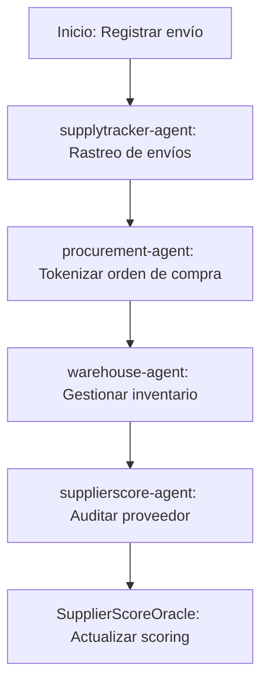

# Sector Supply Chain

## Descripción
Rastreo end-to-end de envíos, órdenes de compra tokenizadas y scoring de proveedores usando agentes y contratos especializados.

## Agentes principales
- `supplytracker-agent`: Rastreo de envíos
- `procurement-agent`: Órdenes de compra tokenizadas
- `warehouse-agent`: Gestión de inventario
- `supplierscore-agent`: Scoring de proveedores

## Contratos relevantes
- `SupplyTracker.sol`: Rastreo de envíos
- `ProcurementOrder.sol`: Órdenes de compra
- `WarehouseInventory.sol`: Inventario
- `SupplierScoreOracle.sol`: Scoring de proveedores

## Ejemplo de flujo
1. Registrar envío y checkpoints
2. Tokenizar orden de compra
3. Auditar proveedor y actualizar scoring

## Diagrama de flujo


## Ejemplo avanzado de integración
```js
// 1. Registrar envío y checkpoints
const shipment = await client.supplychain.registerShipment({
	origin: 'Planta A',
	destination: 'Centro Distribución',
	items: ['ProductoX', 'ProductoY']
});
await client.supplychain.addCheckpoint({
	shipmentId: shipment.id,
	location: 'Bodega Intermedia',
	timestamp: Date.now()
});

// 2. Tokenizar orden de compra
const order = await client.supplychain.tokenizeOrder({
	buyer: '0xComprador',
	supplier: '0xProveedor',
	items: ['ProductoX'],
	total: 5000
});

// 3. Auditar proveedor y actualizar scoring
await client.supplychain.auditSupplier({
	supplier: '0xProveedor',
	score: 95,
	notes: 'Entrega puntual y calidad óptima'
});
```

## Endpoints API
- `GET /v1/supplychain/shipments`
- `POST /v1/supplychain/procurement`

## Ejemplo de código
```js
const shipment = await client.supplychain.registerShipment({ ... });
```
