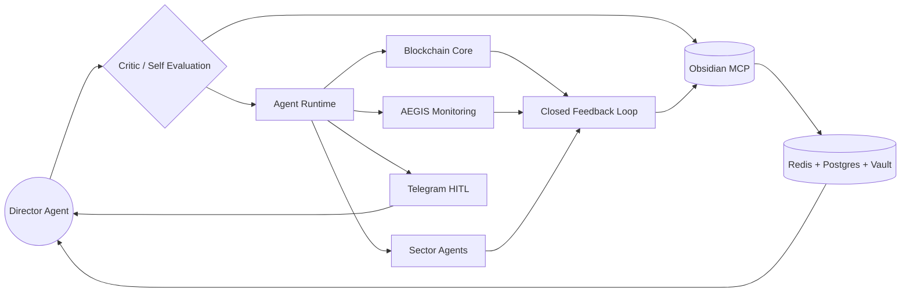

# BeZhas Blockchain Map

Mapa operativo para abrir junto al Canvas [[BeZhas-Autonomy-Loop.canvas]]. La vista del panel admin lo renderiza como un flujo organico: Director al centro, runtime como motor, blockchain/AEGIS como sentidos y Obsidian como memoria consolidada.

## Criterio de uso

Obsidian consolida conocimiento, no ejecuta transacciones. La ejecucion queda en MCP tools con permisos y confirmacion humana por umbral.
