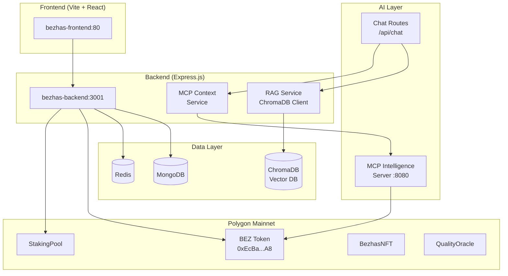

# BeZhas Web3 — System Health Report
## Audit Date: 2026-03-03 | Auditor: DevOps Orchestrator

---

## 1. System Architecture Overview



---

## 2. Critical Issues Found & Corrections Applied

| # | Severity | Issue | Status |
|---|----------|-------|--------|
| 1 | 🔴 CRITICAL | `crypto-payment.routes.js` never mounted — 5 endpoints unreachable | ✅ FIXED |
| 2 | 🔴 CRITICAL | Quality Escrow routes commented out | ✅ FIXED (safe try/catch) |
| 3 | 🟡 MEDIUM | `/api/ai` triple-mounted (L605, L1000, L1089) | ✅ FIXED |
| 4 | 🟡 MEDIUM | `/billing` + `/campaigns` inconsistent paths | ✅ FIXED |
| 5 | 🔴 CRITICAL | No MCP→RAG→Chatbot pipeline | ✅ FIXED (full implementation) |
| 6 | 🔴 CRITICAL | No Vector DB / RAG infrastructure | ✅ FIXED (ChromaDB + 3 collections) |
| 7 | 🟡 MEDIUM | `diagnostic.routes` double-mounted | ✅ FIXED |

---

## 3. RAG Pipeline Architecture (NEW)

### Components Created

| File | Purpose |
|------|---------|
| `backend/services/rag.service.js` | ChromaDB integration — 3 collections, embedding, retrieval |
| `backend/services/mcp-context.service.js` | MCP bridge — fetches live gas/token/swap/DAO data |
| `backend/routes/chat.routes.js` (modified) | Injects RAG + MCP context into AI prompts |
| `scripts/rag-indexer.js` | Seeds ChromaDB with 14 platform docs + sample data |

### Data Flow

```
User Message → chat.routes.js
                  ├─→ ragService.retrieveContext(message)   → ChromaDB query
                  ├─→ mcpContext.getFullBlockchainContext()  → MCP HTTP calls
                  │     ├─ /api/mcp/analyze-gas
                  │     ├─ /api/mcp/blockscout
                  │     ├─ /api/mcp/calculate-swap
                  │     └─ /api/mcp/tally-dao
                  └─→ Build system prompt with context
                       └─→ OpenAI / Gemini / Fallback → Response
```

### ChromaDB Collections

| Collection | Content | Use |
|-----------|---------|-----|
| `bezhas_payments` | TX metadata (Stripe/crypto) | Answer "what was my last payment?" |
| `bezhas_blockchain` | On-chain events (transfers, staking) | Answer "who staked recently?" |
| `bezhas_platform` | 14 FAQs, guides, tokenomics docs | Answer "how does staking work?" |

---

## 4. RAG Bottleneck Analysis

| Bottleneck | Risk | Mitigation |
|-----------|------|------------|
| ChromaDB cold start | First query takes ~500ms | RAG service initializes eagerly on module load |
| MCP server latency | Gas/Blockscout calls timeout | 1-minute cache + 5s timeout per MCP call |
| Embedding computation | Gemini embedding API has rate limits | Fallback to ChromaDB's built-in sentence-transformers |
| ChromaDB single-node | Not HA in docker-compose | Production: use managed Qdrant or Pinecone |

---

## 5. Payment Endpoint Vulnerability Assessment

| Endpoint | Risk | Status |
|----------|------|--------|
| `POST /api/crypto/initiate` | **Was unreachable** — now mounted | ✅ Fixed |
| `POST /api/stripe/create-token-purchase-session` | Rate limited ✓, JWT auth ✓ | ✅ Secure |
| `POST /api/payment/process` | Input validation ✓, rate limiting ✓ | ✅ Secure |
| `POST /api/chat` | Gatekeeper (credit check) ✓, rate limited ✓ | ✅ Secure |
| `GET /api/config` | Config rate limiter (10 req/min) ✓ | ⚠️ Leaks ABI data (by design) |
| `POST /api/config` | Admin token required ✓, private key filter ✓ | ✅ Secure |
| `POST /api/notifications/send` | Validates Ethereum address ✓ | ⚠️ No auth required |

---

## 6. Deployment Commands (GCP Cloud Run)

### Quick Deploy (Full Pipeline)
```bash
# From project root
gcloud builds submit --config=cloudbuild.yaml
```

### Individual Service Deploy

#### Backend
```bash
# Build
docker build -t us-central1-docker.pkg.dev/PROJECT_ID/bezhas/bezhas-backend:v2 \
  -f backend/Dockerfile.gcp .

# Push
docker push us-central1-docker.pkg.dev/PROJECT_ID/bezhas/bezhas-backend:v2

# Deploy
gcloud run deploy bezhas-backend \
  --image us-central1-docker.pkg.dev/PROJECT_ID/bezhas/bezhas-backend:v2 \
  --region us-central1 \
  --platform managed \
  --allow-unauthenticated \
  --port 8080 \
  --min-instances 1 \
  --max-instances 10 \
  --memory 2Gi \
  --cpu 2 \
  --concurrency 80 \
  --timeout 300 \
  --set-env-vars "NODE_ENV=production,CHROMA_URL=http://chromadb-svc:8000" \
  --set-secrets "MONGODB_URI=MONGODB_URI:latest,JWT_SECRET=JWT_SECRET:latest,GEMINI_API_KEY=GEMINI_API_KEY:latest,MCP_SERVER_URL=MCP_SERVER_URL:latest"
```

#### Frontend
```bash
docker build -t us-central1-docker.pkg.dev/PROJECT_ID/bezhas/bezhas-frontend:v2 \
  -f frontend/Dockerfile.gcp \
  --build-arg VITE_API_URL=https://bezhas-backend-o5xep6gbwq-uc.a.run.app \
  --build-arg VITE_MCP_URL=https://bezhas-intelligence-o5xep6gbwq-uc.a.run.app .

docker push us-central1-docker.pkg.dev/PROJECT_ID/bezhas/bezhas-frontend:v2

gcloud run deploy bezhas-frontend \
  --image us-central1-docker.pkg.dev/PROJECT_ID/bezhas/bezhas-frontend:v2 \
  --region us-central1 \
  --platform managed \
  --allow-unauthenticated \
  --port 80 \
  --min-instances 0 \
  --max-instances 50
```

#### MCP Intelligence Server
```bash
docker build -t us-central1-docker.pkg.dev/PROJECT_ID/bezhas/bezhas-intelligence:v2 \
  -f packages/mcp-server/Dockerfile packages/mcp-server

docker push us-central1-docker.pkg.dev/PROJECT_ID/bezhas/bezhas-intelligence:v2

gcloud run deploy bezhas-intelligence \
  --image us-central1-docker.pkg.dev/PROJECT_ID/bezhas/bezhas-intelligence:v2 \
  --region us-central1 \
  --platform managed \
  --allow-unauthenticated \
  --port 8080 \
  --min-instances 0 \
  --max-instances 5 \
  --memory 512Mi \
  --cpu 1 \
  --set-env-vars "NODE_ENV=production,HTTP_PORT=8080"
```

### Local Development (Full Stack)
```bash
# Start all services with ChromaDB
docker compose -f docker-compose.optimized.yml up -d

# Seed RAG data
node scripts/rag-indexer.js

# Run stress test
node scripts/stress-test-500.js --target http://localhost:3001 --concurrency 500
```

---

## 7. Files Created / Modified

### New Files
| File | Size | Purpose |
|------|------|---------|
| `backend/services/rag.service.js` | 8.5 KB | ChromaDB RAG service |
| `backend/services/mcp-context.service.js` | 5.5 KB | MCP blockchain context bridge |
| `scripts/rag-indexer.js` | 6.2 KB | RAG data seeder |
| `scripts/stress-test-500.js` | 8.8 KB | 500-connection stress test |
| `docker-compose.optimized.yml` | 4.2 KB | Full stack with ChromaDB |

### Modified Files
| File | Changes |
|------|---------|
| `backend/server.js` | Mounted orphan routes, removed duplicates, re-enabled quality-escrow |
| `backend/routes/chat.routes.js` | Injected RAG+MCP context into AI response pipeline |
